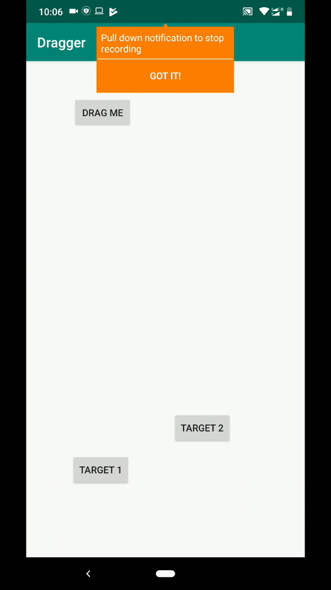

# Dragger

Drag Any View to touch another view and create a event in Android

Step 1. Add the JitPack repository to your build file

Add it in your root build.gradle at the end of repositories:

        allprojects {
            repositories {
              ...
              maven { url 'https://jitpack.io' }
            }
          }
          
Step 2. Add the dependency

          dependencies {
	            implementation 'com.github.shmehdi01:Dragger:v1.0'
        	}
          
Step 3. Here is the simple code

          Dragger.create()
                .setDragView(dragViewBtn)
                .setTargetViews(new View[]{targetViewOne, targetViewTwo})
                .setDragEventListener(new Dragger.DragEventListener() {
                    @Override
                    public void onDragComplete(View targetView) {
                        if (targetView.equals(targetViewOne)) {
                            Toast.makeText(this, "Target 1 complete", Toast.LENGTH_SHORT).show();
                        } else if (targetView.equals(targetTwo)) {
                            Toast.makeText(this, "Target 2 complete", Toast.LENGTH_SHORT).show();
                        }
                    }
                })
                .startDragging();
